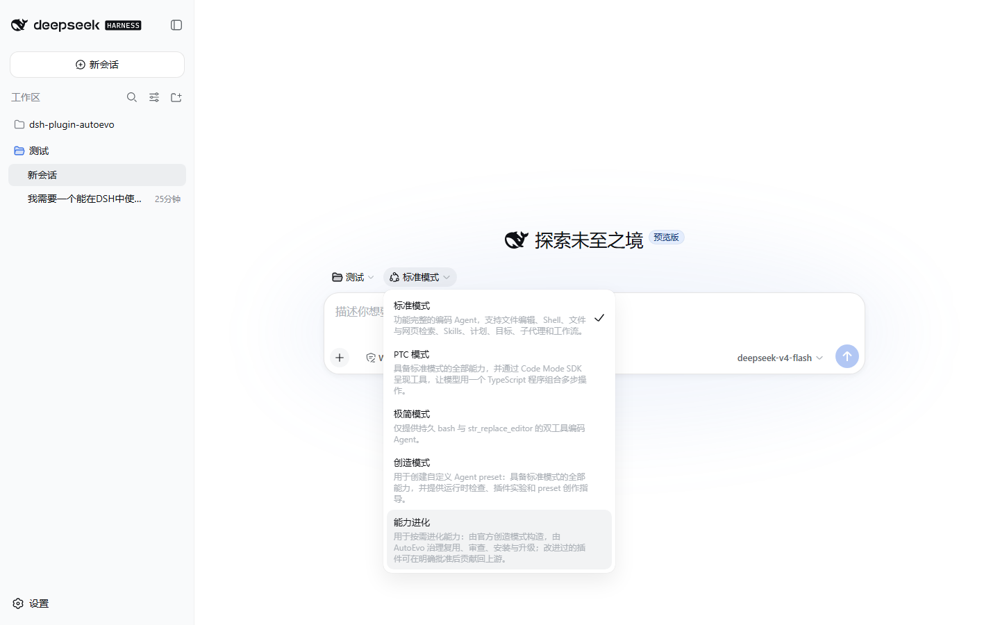
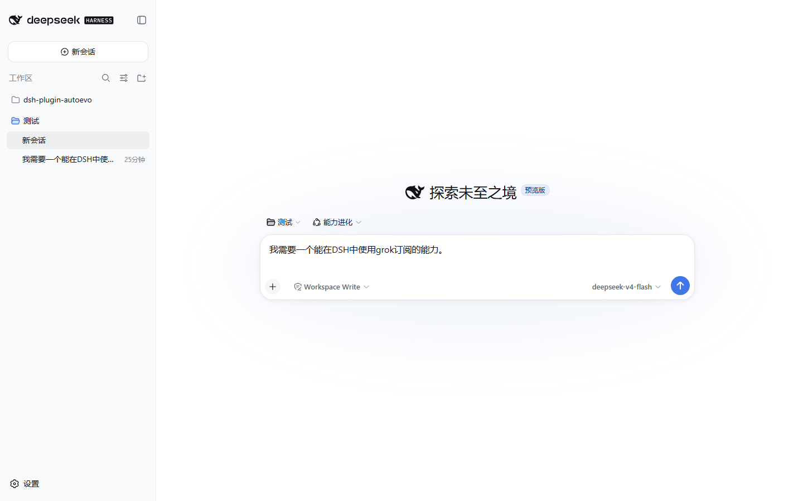
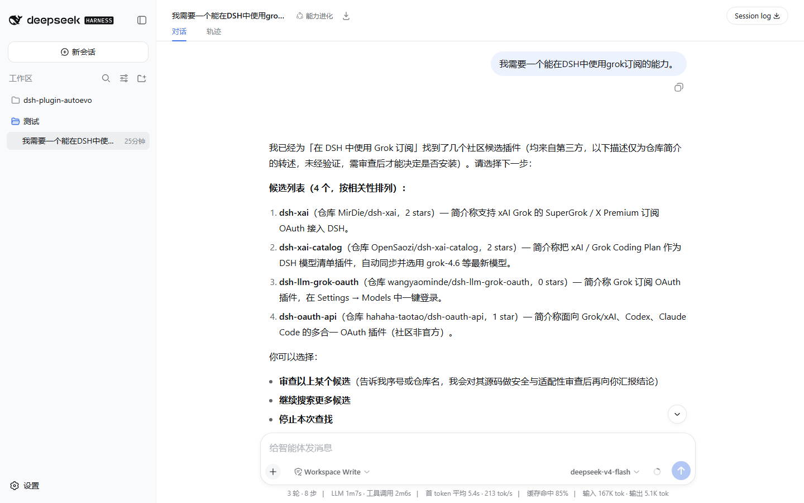
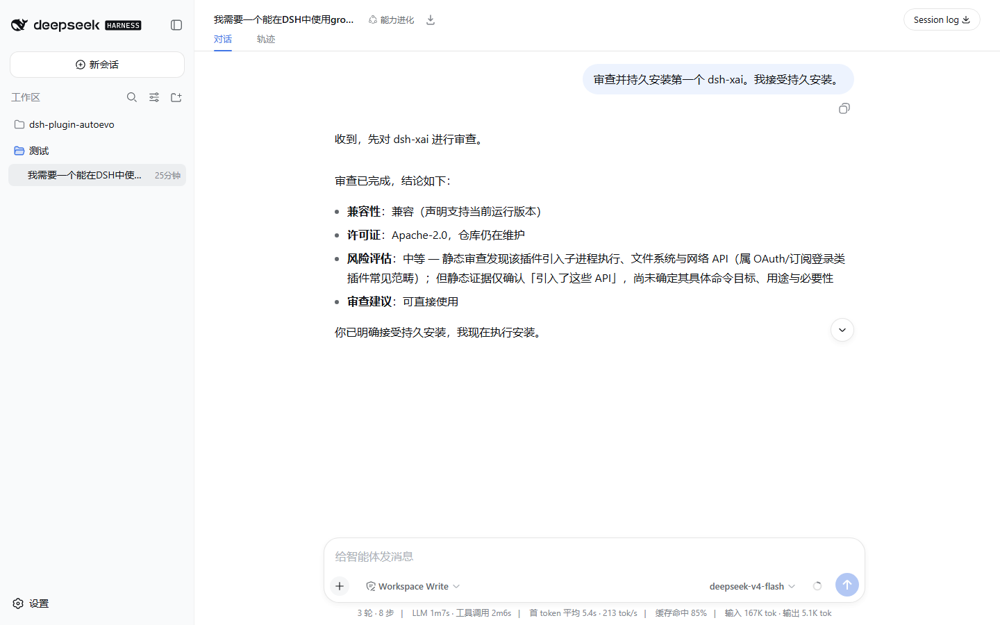
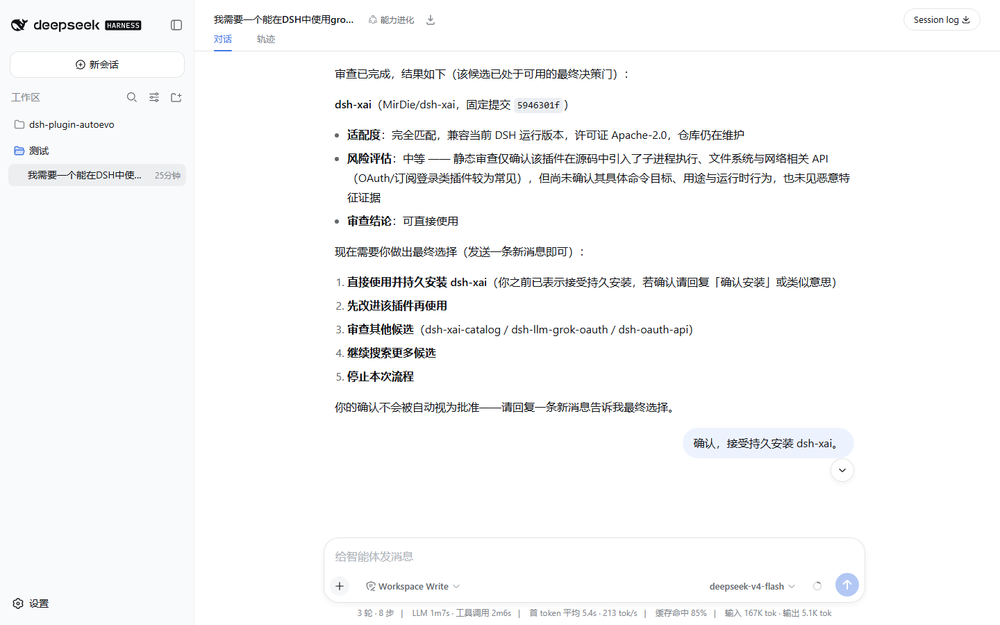
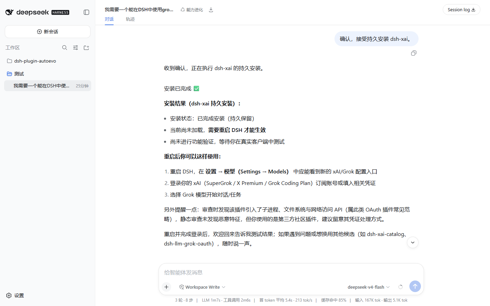

# AutoEvo

English | [中文](README.md)

> Evolution continues.

<p align="center">
  
</p>

`dsh-plugin-autoevo` is the capability-reuse and safe-evolution layer for DeepSeek Harness (DSH). The Capability Evolution preset is a superset of official Creator mode: runtime inspect, live plugin experiments, preset authoring, and delegation stay available. When an Agent needs a reusable capability, AutoEvo checks local tools and skills first, then discovers, reviews, and installs community plugins. If a candidate is close but incomplete, it can be changed, re-reviewed, and installed from a Host-managed source.

`Resolve → Search → Review → Deploy → Verify → Upgrade`

`Reuse before build. Improve before replace.`

## Documentation

| Audience / topic | Entry point |
| --- | --- |
| Users: install, first run, two confirmation gates, outcomes, and recovery | [User Guide](docs/user-guide.en.md) |
| Developers: local setup, runtime entry points, tests, debugging, and contribution | [Developer Guide](docs/developer-guide.en.md) |
| Policy, data layout, and runtime seams | [Architecture](docs/architecture.md) (Chinese) |
| Trust boundaries, install gates, and verification evidence | [Security Model](docs/security.md) (Chinese) |
| Reproducible scenarios and evidence levels | [Real-world Samples](docs/real-world-samples.md) (Chinese) |

Each topic has one canonical home: operating procedures live in the User Guide, development workflows in the Developer Guide, and internal state/security invariants in the architecture and security references.

## Install

Install into the DSH profile you actually use. This example targets `web` (run DSH through npx; no global install needed):

```powershell
npx @deepseek-ai/dsh plugin --profile web add --save-exact github:klarkxy/dsh-plugin-autoevo#v0.5.1
```

Start the profile day to day with `npx @deepseek-ai/dsh web`. Note the unscoped `dsh` package on npm is an unrelated project — the command must carry the `@deepseek-ai/` prefix.

Restart the target DSH profile after installing or upgrading AutoEvo so it loads the new bundle; whether later capability installs need another restart is covered in [User Guide §5](docs/user-guide.en.md#5-outcomes-and-next-steps).

The install command uses the latest release tag; the `package.json` version may be ahead of the latest published release. Node.js must satisfy `>=22.19.0 || >=24.0.0`; current development and acceptance use DSH `0.1.0-rc.6` and Cordis `4.0.1`.

## Quick start

1. Start a new DSH session and select the **Capability Evolution** user preset (id `evolution`).
2. Describe the needed capability in ordinary language, for example:

   > I need a DSH plugin that can calculate scientific notation. Search for an existing one first.

3. When AutoEvo presents 1–5 candidates, use a fresh chat message to choose the candidate to review.
4. After review, use another fresh message to decide whether to reuse, install, improve, search again, create from scratch, or stop.

Those replies are two separate confirmation gates; the full flow and rationale are in [User Guide §3](docs/user-guide.en.md#3-your-first-complete-workflow).

Install demo (select preset → describe the need → shortlist → review → confirm → installed):

<p align="center">
  
  
  
  
  
  
</p>

## Understand the outcome

| Result | Meaning | Next step |
| --- | --- | --- |
| `verified` | The Host completed the expected tool round trip | Use the capability |
| `activated` / `awaiting_user_test` | Loaded without round-trip evidence, or needs a real client/profile test | Try it once in the target profile |
| `restartRequired: true` | A non-failure install result exists, but the current process did not fully hot-load it | Restart the target profile |
| `failed_absent` / `recovery_required` | Installation failed, or install/cleanup state cannot be determined safely | Inspect diagnostics; recover first when the state is unclear |

`installed` and `loaded` do not mean functionally verified. Only `verified` supports that claim. See [Outcomes and next steps](docs/user-guide.en.md#5-outcomes-and-next-steps).

## Safety boundary

- Discovery, review, and diagnosis are read-only by default. Install, removal, modify, and create require a real user decision and one-time DSH approval; installed third-party code ultimately runs with the current user's authority.
- See the [Security Model](docs/security.md) for the full trust boundary, and [User Guide §8](docs/user-guide.en.md#8-safety-and-privacy) for safety and privacy notes in daily use.

## Develop

```powershell
pnpm install --frozen-lockfile
pnpm check
```

See the [Developer Guide](docs/developer-guide.en.md) for source layout, generated `lib/`, the test matrix, and release gates.

## License

SATA. See [LICENSE](./LICENSE).
