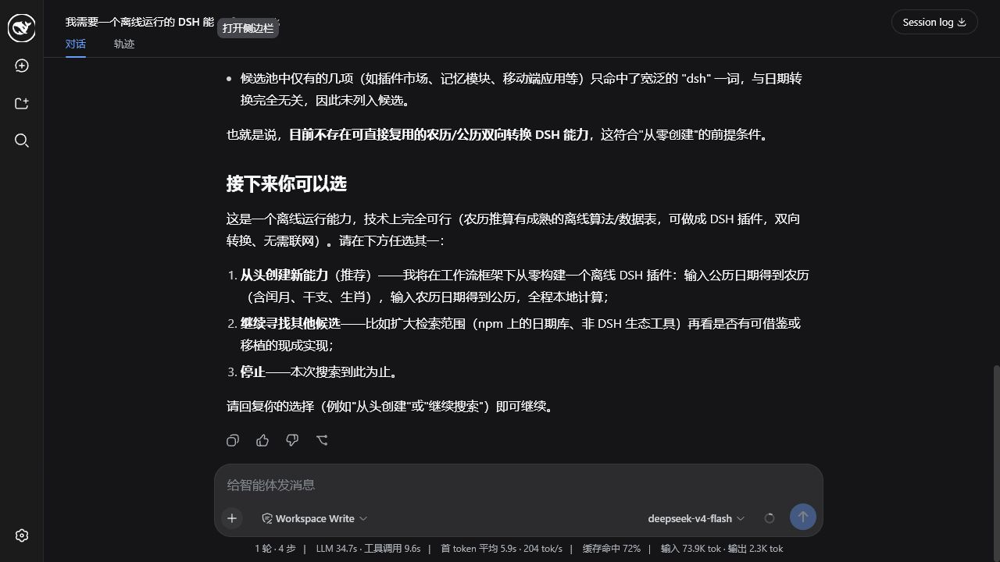
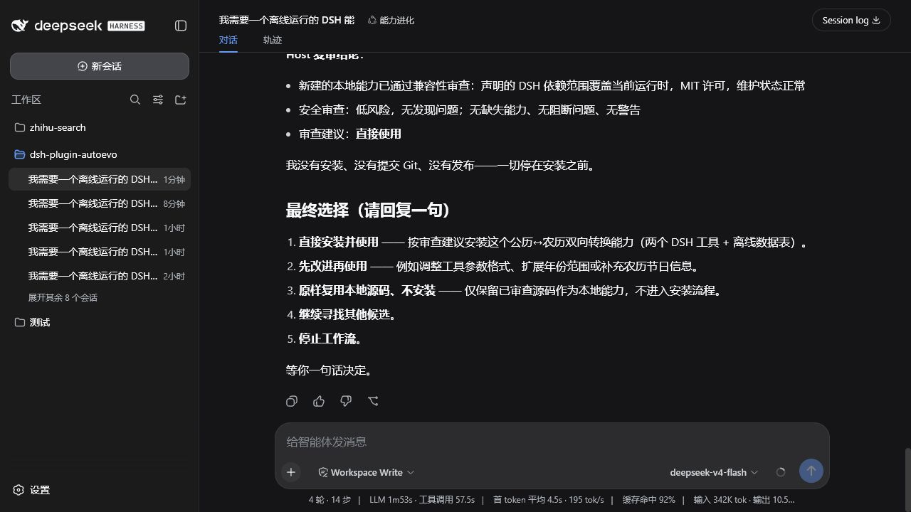
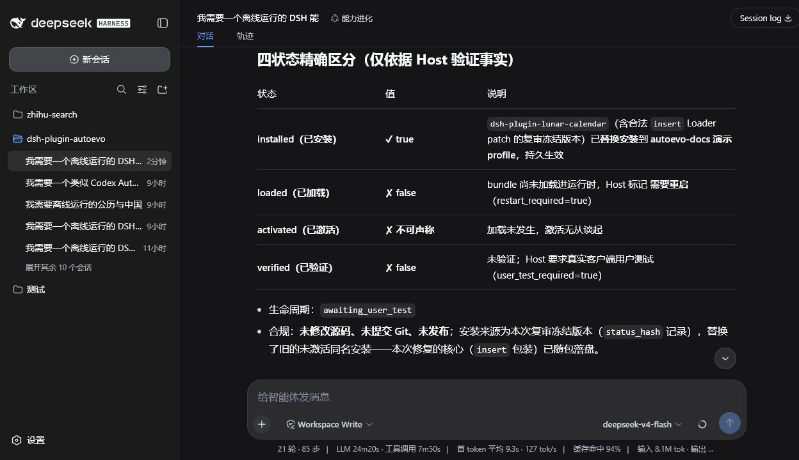
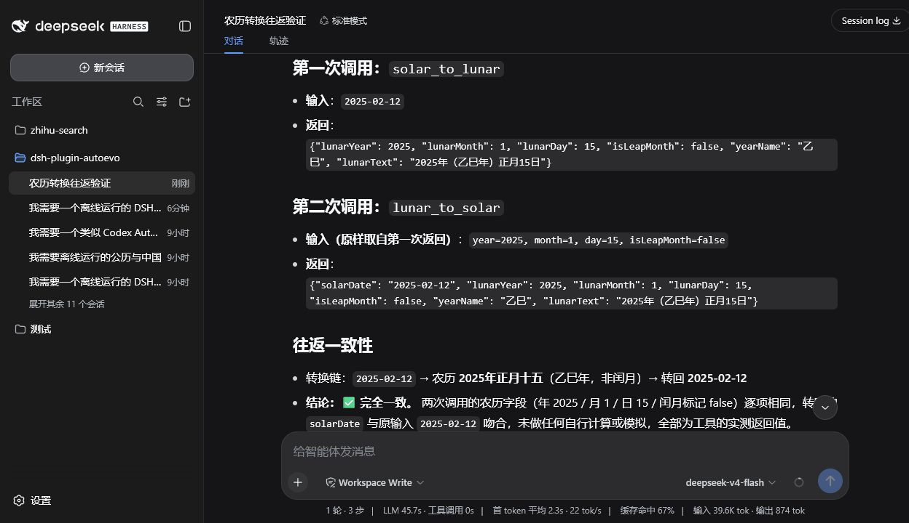
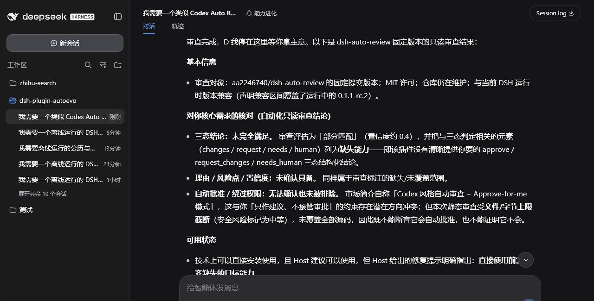
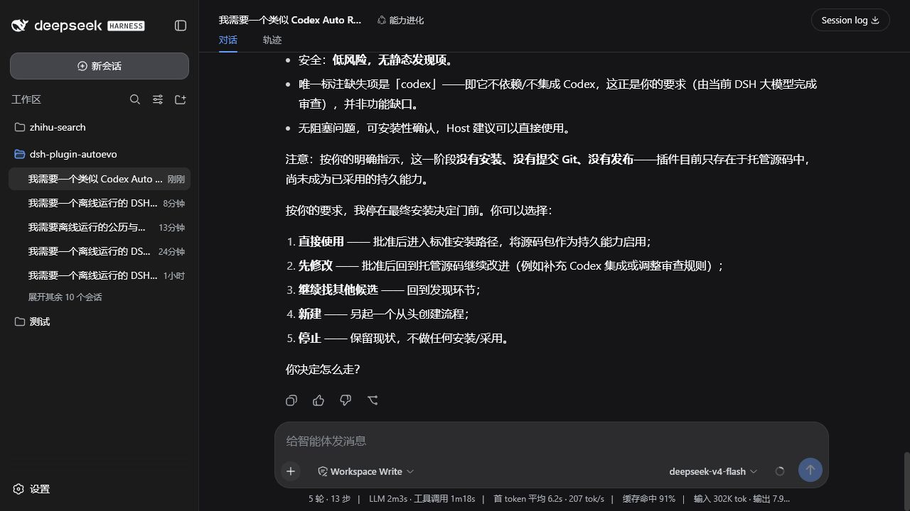
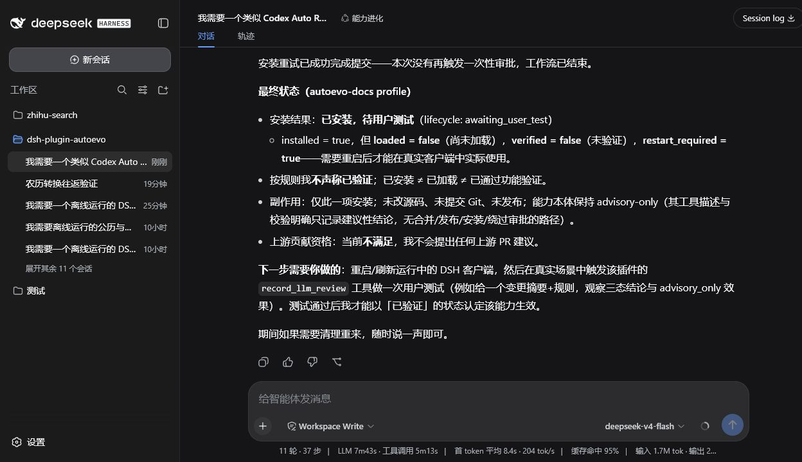
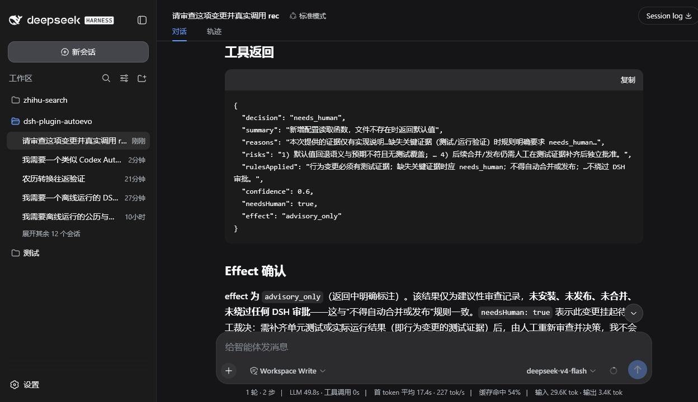

# AutoEvo

[English](README.en.md) | 中文

> 进化永不停歇。

<p align="center">
  
</p>

`dsh-plugin-autoevo` 是 DeepSeek Harness（DSH）的轻量能力复用工作流与证据插件。在 **能力进化** preset 中，所有能力需求——包括临时实验——都先走 Search-first：Host 保留用户原话，必要时只澄清一次，然后检查本地与远程候选。候选只差一点时，可在 Host 绑定的托管源码中修改、重审和安装；用户最终采用的能力统一持久化并带有可检查的结果回执。

`Resolve → Search → Review → Deploy → Verify → Upgrade`

`Reuse before build. Improve before replace.`

## 文档

| 读者 / 主题 | 入口 |
| --- | --- |
| 使用者：安装、首次使用、两道确认门、状态与恢复 | [使用指南](docs/user-guide.md) |
| 开发者：本地环境、架构入口、测试、调试与贡献 | [开发者指南](docs/developer-guide.md) |
| Policy、数据布局和运行时接缝 | [架构说明](docs/architecture.md) |
| 信任边界、安装门槛和验证证据 | [安全模型](docs/security.md) |

详细文档遵循单一权威原则：操作步骤以使用指南为准，开发流程以开发者指南为准，内部状态与安全不变量分别以架构和安全文档为准。

## 安装

安装到正在使用的 DSH profile；下面以 `web` 为例（通过 npx 运行 DSH，无需全局安装）：

```powershell
npx @deepseek-ai/dsh plugin --profile web add --save-exact github:klarkxy/dsh-plugin-autoevo#v1.0.0
```

日常启动该 profile 用 `npx @deepseek-ai/dsh web`。注意 npm 上无 scoped 的 `dsh` 包是无关项目，命令必须带上 `@deepseek-ai/` 前缀。

安装或升级后重启对应的 DSH profile，让它加载新 bundle；之后为其它能力执行安装时是否需要再次重启，见[使用指南 §5](docs/user-guide.md#5-结果状态与下一步)。

上面的命令在维护者发布 `v1.0.0` 后可用；创建 tag 和 Release 是独立操作。Node.js 要求 `^22.19.0 || ^24.0.0`。AutoEvo 接受 DSH `>=0.1.0-rc.6 <0.2.0`，未单独验证的 `0.1` 更新会保留警告并允许实际运行；当前可复现的开发与验收基线固定为 DSH `0.1.1-rc.2`、Cordis `4.0.1`。

## 快速体验

1. 在 DSH 新建会话，选择用户 preset **能力进化**（id `evolution`）。
2. 用自然语言说明需要的能力，例如：

   > 我需要一个能同步项目记录的 DSH 插件。先查现成的。

3. 需求有实质歧义时，先回答一次澄清；随后 AutoEvo 给出 1–5 个候选，或明确告知没有匹配候选。
4. 有候选时，用新的正常聊天消息选择要审查的候选；无候选时，选择继续搜寻、创建新能力或停止。
5. 审查完成后，再用一条新的消息决定原样使用、安装、修改、继续搜索、从零创建或停止。

这两次回复是两道独立的用户确认门；完整流程与原理见[使用指南 §3](docs/user-guide.md#3-第一次完整使用)。

典型闭环是：Search-first → 选择候选 → 审查事实与警告 → 用户决定 → 安装或托管施工 → 重新审查 → 用户确认最终安装 → 区分安装、加载、激活与验证结果。生产逻辑不读取示例或测试 fixture；截图只是匿名化的产品行为记录。

## 实际流程截图

真实空结果后的离线公历/农历转换能力：









类似 Codex Auto Review 的大模型自动审查能力：先审查最接近的候选，再由用户决定创建一个只提供建议、不接管 DSH 审批的轻量工具。









两次真实运行都继续完成了 DSH 一次性审批、安装和重启后的客户端工具调用。安装结果仍严格区分 `installed`、`loaded`、`activated` 与 `verified`；截图中的真实往返是后续客户端证据，不会倒写或夸大安装时的回执。

完整逐步截图和每一步的准确状态见 [`example/README.md`](example/README.md)。

## 怎样理解结果

| 结果 | 含义 | 下一步 |
| --- | --- | --- |
| `verified` | Host 完成了预期工具往返，功能已验证 | 可以直接使用 |
| `activated` / `awaiting_user_test` | 已加载但没有工具往返证据，或需在真实客户端/profile 中人工测试 | 在目标 profile 中实际试用一次 |
| `restartRequired: true` | 安装已形成非失败结果，但当前进程没有完整热加载 | 重启对应 profile 后再试 |
| `failed_absent` / `recovery_required` | 安装失败，或安装/清理状态不能安全判定 | 查看诊断；状态不明时先恢复，不要盲目重装 |

`installed` 或 `loaded` 不等于功能已验证；只有 `verified` 才能这样表述。完整状态和恢复步骤见[使用指南](docs/user-guide.md#5-结果状态与下一步)。

AutoEvo 还跟踪每个包的安装版本链：`capability_versions` 列出版本，`capability_rollback` 回滚到历史版本（仍走标准批准安装），`capability_adopt` 把工作流外手工安装的插件登记入台账，`capability_updates` 只读检查上游更新。详见[使用指南 §4.6](docs/user-guide.md#46-版本领养与上游更新)。

## 安全边界

- AutoEvo 负责工作流、警告和证据记录；DSH Core 负责权限、sandbox 与 approval 的实际执行。AutoEvo 不能扩大、替代或绕过这些 DSH Core 控制。
- 发现、审查和诊断默认只读；安装、移除、修改和新建的实际副作用仍由 DSH Core 的权限与一次性 approval 决定。警告会展示并记录，但在 DSH Core 允许且用户明确接受时可以继续；安装的第三方代码最终以当前用户权限运行。
- 完整信任边界见[安全模型](docs/security.md)；使用中的安全与隐私注意事项见[使用指南 §8](docs/user-guide.md#8-安全与隐私提示)。

## 开发

```powershell
pnpm install --frozen-lockfile
pnpm check
```

源码、生成的 `lib/`、测试矩阵和发布前检查见[开发者指南](docs/developer-guide.md)。

## 许可

SATA，见 [LICENSE](./LICENSE)。
